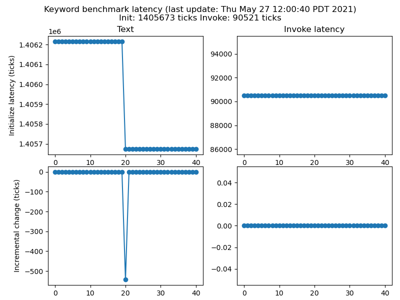

<!-- mdformat off(b/169948621#comment2) -->

<!--
Semi-automated TOC generation with instructions from
https://github.com/ekalinin/github-markdown-toc#auto-insert-and-update-toc

gh-md-toc --insert --no-backup xtensa.md
-->

<!--ts-->
   * [Summary](#summary)
   * [Detailed Results](#detailed-results)
      * [Hifimini](#hifimini)
         * [Unit tests](#unit-tests)
         * [Keyword Benchmark](#keyword-benchmark)
            * [Binary size graph](#binary-size-graph)
            * [Latency graph](#latency-graph)
      * [Hifi4](#hifi4)
         * [Unit tests](#unit-tests-1)
         * [Keyword Benchmark](#keyword-benchmark-1)
            * [Binary size graph](#binary-size-graph-1)
            * [Latency graph](#latency-graph-1)

<!-- Added by: advaitjain, at: Fri 04 Dec 2020 01:32:43 PM PST -->

<!--te-->

# Summary

* Overall status (as seen on the tensorflow repo): 

* Table with more granular results

| Architecture |  Keyword benchmark (build) | Unit tests |
| ---------- |       -------              |  --------  |
| Hifimini  |  |  |
| Hifi4  | |  |

# Detailed Results

## Hifimini

### Unit tests
* [Unit test build log](hifimini_unittest_log) from the most recent run.
* [Unittest status history](hifimini_unittest_status)

### Keyword Benchmark

* [Keyword benchmark build log](hifimini_build_log) from the most recent run.
* [Keyword benchmark build status history](hifimini_build_status)
* [Keyword Benchmark size history](hifimini_size_log)
* [Keyword Benchmark latency history](hifimini_size_log)

#### Binary size graph

#### Latency graph

## Hifi4

### Unit tests

### Keyword Benchmark

#### Binary size graph

#### Latency graph

